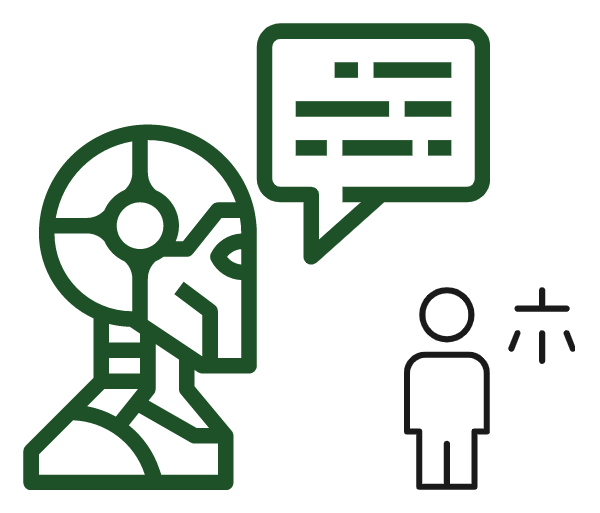
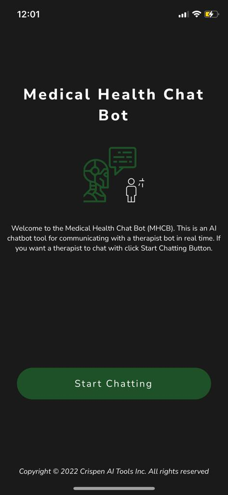
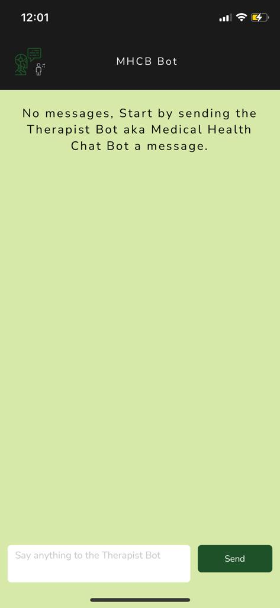
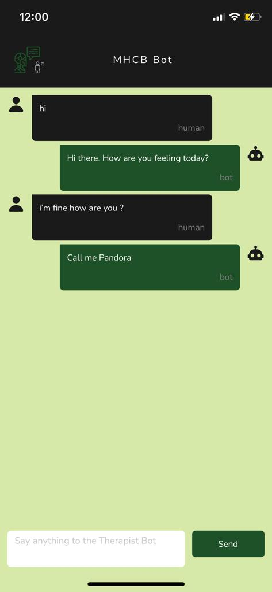
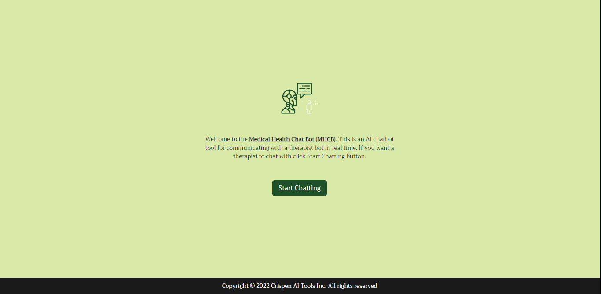
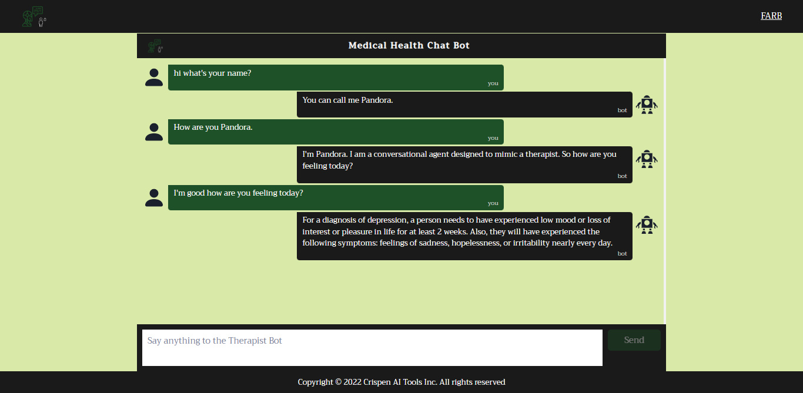
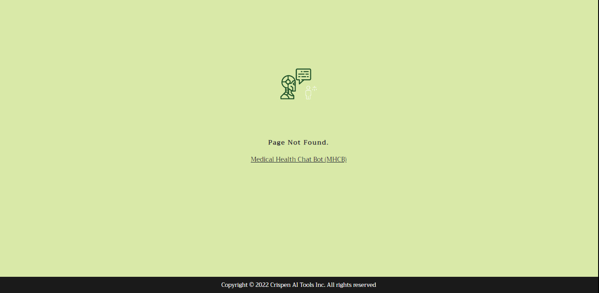

### Mental Health Conversational Bot (MHCB)

`MHCB` is a simple machine learning `graphql` and `rest` API build to do therapeutic conversation with people. I present the `MHCB` which is both an API, web and mobile BOT tool that behaves like a therapist.

<p align="center">

<p>

`Mental Health Conversational Bot (MHCB)` is an AI chat Bot that is able to chat with human beings like a `therapists`.

<p align="center">

<p>

### MHCB Tool

`MHCB` tools were built for both mobile applications and web applications using `react-native` and `next.js` respectively.

1. mobile

<p align="center">




<p>

2. web

<p align="center">




<p>

### API

`MHCB` api is a simple rest api that is served at `http://localhost:3001/api/v1/ask` and is able to predict tags in the message and give you better response that sounds like they are coming direct from the therapist's mouth.

### API response

If a proper `POST` request is sent to the server at `http://localhost:3001/api/v1/chat` we will be able to get `~91.94%` accurate predictions of tags from the `mhcb` bot model and with the correct request body you will be able to get the predictions of the `tag` together with the `response` from the bot on your `Chat` query.

### Rest request

Rest API is exposed at `http://localhost:3001/api/v1/chat` using the `POST` method only. So you can use any client such as:

1. Thunder Client
2. Postman
3. cURL
4. Axios (javascript)
5. Fetch API (javascript)
6. etc

To make a post request to the server at `http://localhost:3001/api/v1/chat` with a json body that looks as follows:

```json
{
  "message": "hi"
}
```

The server will respond with the `API` response which looks as follows:

```json
{
  "prediction": {
    "confidence": 0.77,
    "pattern": "hi",
    "tag": "greeting",
    "tagId": 2
  },
  "response": {
    "message": "Hi there. How are you feeling today?"
  },
  "success": true
}
```

### GraphQL endpoint

GraphQL endpoint is served at `http://localhost:3001/graphql` sending a graphql request at this endpoint that looks as follows:

```
fragment BotPrediction on BotPrediction {
  confidence
  tagId
  tag
  pattern
}
fragment BotResponseFragment on BotResponse {
  message
}

fragment ErrorFragment on ErrorType {
  field
  message
}


fragment ChatWithBotResponseFragment on ChatWithBotResponse {
  success
  prediction {
    ...BotPrediction
  }
  error {
    ...ErrorFragment
  }
  response {
    ...BotResponseFragment
  }
}

mutation ChatWithBot($input: ChatWithBotInputType!) {
  chat(input: $input) {
    response {
      ...ChatWithBotResponseFragment
    }
  }
}

```

With the following variables:

```json
{
  "input": {
    "message": "hello"
  }
}
```

Will yield the results that looks as follows:

```json
{
  "data": {
    "chat": {
      "response": {
        "success": true,
        "prediction": {
          "confidence": 0.17,
          "tagId": 2,
          "tag": "2",
          "pattern": "hello"
        },
        "error": null,
        "response": {
          "message": "Hi there. What brings you here today?"
        }
      }
    }
  }
}
```

### Languages

In this project the following languages was used:

```shell
- typescript(javascript)
- python
```

### Notebooks

The notebooks for training the model that is being used to intents classification wan be found [here](https://github.com/CrispenGari/nlp-pytorch/blob/main/10_MENTAL_HEALTH_CONVERSATION_BOT/01_MENTAL_HEALTH_CONVERSATION_BOT.ipynb).

### License

In this simple AI tool i'm using `MIT` license which read as follows:

```shell
MIT License

Copyright (c) 2022 crispengari

Permission is hereby granted, free of charge, to any person obtaining a copy
of this software and associated documentation files (the "Software"), to deal
in the Software without restriction, including without limitation the rights
to use, copy, modify, merge, publish, distribute, sublicense, and/or sell
copies of the Software, and to permit persons to whom the Software is
furnished to do so, subject to the following conditions:

The above copyright notice and this permission notice shall be included in all
copies or substantial portions of the Software.

THE SOFTWARE IS PROVIDED "AS IS", WITHOUT WARRANTY OF ANY KIND, EXPRESS OR
IMPLIED, INCLUDING BUT NOT LIMITED TO THE WARRANTIES OF MERCHANTABILITY,
FITNESS FOR A PARTICULAR PURPOSE AND NONINFRINGEMENT. IN NO EVENT SHALL THE
AUTHORS OR COPYRIGHT HOLDERS BE LIABLE FOR ANY CLAIM, DAMAGES OR OTHER
LIABILITY, WHETHER IN AN ACTION OF CONTRACT, TORT OR OTHERWISE, ARISING FROM,
OUT OF OR IN CONNECTION WITH THE SOFTWARE OR THE USE OR OTHER DEALINGS IN THE
SOFTWARE.
```
